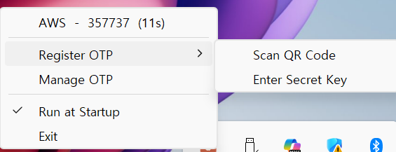

# Ddoli OTP

A lightweight Windows system tray TOTP (Time-based One-Time Password) manager.



## Features

- **System Tray Integration** — Left-click or right-click the tray icon to access your OTP codes
- **One-Click Copy** — Click an OTP entry to instantly copy the code to clipboard
- **Live Countdown** — Remaining seconds displayed next to each code
- **QR Code Scanning** — Register OTP by dragging a screen region over a QR code
- **Manual Entry** — Add OTP via Secret Key (Base32) input
- **Manage OTP** — Rename or delete entries
- **Run at Startup** — Optional Windows auto-start via registry

## Download

Download the latest `DdoliOTP.exe` from the link below (no installation required):

[**Download DdoliOTP.exe**](https://ddoli-otp.s3.ap-northeast-2.amazonaws.com/DdoliOTP.exe)

## Development

### Requirements

- Python 3.12+
- Windows

### Setup

```bash
python -m venv venv
venv\Scripts\pip install -r requirements.txt
```

### Run

```bash
venv\Scripts\pythonw.exe otp_tray.py
```

### Build EXE

```bash
pip install pyinstaller
pyinstaller --noconsole --onefile --name DdoliOTP --icon app_icon.ico otp_tray.py
```

## Data Storage

OTP data is stored locally at:

```
%LOCALAPPDATA%\DdoliOTP\otp_data.json
```

## License

MIT
